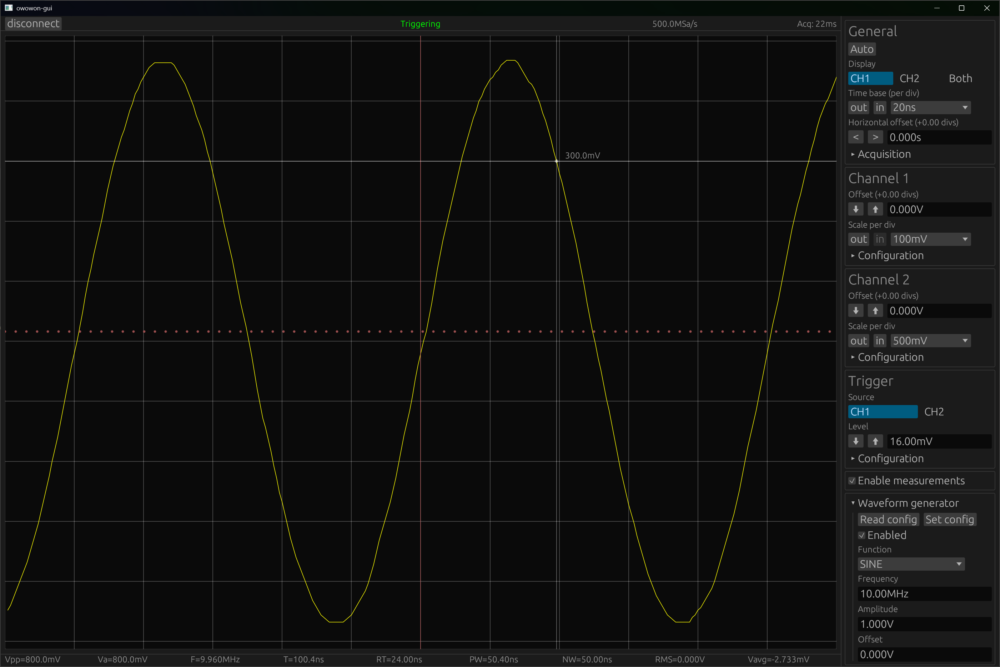

# owowon - A small oscilloscope UI for the Owon HDS series portable oscilloscopes

Screenshot of the program, reading a 10 MHz sine wave generated by the HDS2102S itself:

Videos of a couple of actions on the calibration square wave (everything is synchronized with the oscilloscope):

https://github.com/seritools/owowon/assets/5844066/280d3e0c-2cc3-4c9a-8ee1-e39e07420e31

https://github.com/seritools/owowon/assets/5844066/8ce4500a-6455-44d2-8d2e-5c12dd109427

https://github.com/seritools/owowon/assets/5844066/39abd056-9cb6-4d76-b3cf-fb16e1796c3d

## Windows only

I mostly created this for myself, putting on the reverse engineering hat to figure out how to talk
to the device, giving egui a spin UI-wise, and checking out the WinUSB support of the Windows
Runtime. The USB communication is thus tied to Windows right now, but should be able to be ported
without too much hassle. The rest of the program is platform agnostic, to the extent that egui is.

## Supported devices

So far, this program has only been tested with the HDS2102S oscilloscope, with firmware version
1.5.1. I assume it's going to work mostly fine with other oscilloscopes from the same model range,
though more or fewer bugs than what's listed here might be present. Feel free to create issues or
pull requests if you like to expand the support.

## Installation

The official Owon software uses `libusb` as driver, but since I wanted to give WinRT/WinUSB a spin,
I "converted" it into a WinUSB device using [Zadig](https://zadig.akeo.ie/). The corresponding
driver is provided in the `winusb driver` folder in this repository, but you can [generate your
own](docs/zadig.png) through that tool if you like. You'll need it for the program to detect the
oscilloscope.

## Features

- Much, _much_ faster data acquisition than the Owon tool (up to ~100 readings per second,
  depending on the number of active channels and whether measurements are enabled or not), and
  allows changing settings while acquiring.
- More measurements (see [limitations](#limitations) below)
- Almost everything needed for everyday usage is controllable through the UI ([image of the sidebar
  UI](docs/settings.png)):
  - Auto function
  - Channel enablement
  - Timebase, Horizontal offset
  - Acquisition mode, Sample depth
  - Per channel: Vertical offset, scale, probe attenuation, coupling
  - Trigger: Source, level (see [limitations](#limitations) below), mode, triggering edge, coupling
  - Measurements
  - Function generator (see [limitations](#limitations) below)

Note: DMM readout/control support is technically possible, but currently not implemented.

## Keyboard Shortcuts

- Toggle measurements: `M`
- Horizontal zoom in/out (time base): `PageUp`/`PageDown` or mouse wheel up/down
  - with `Ctrl`: vertical zoom in/out (voltage scale). This affects Ch1 (or Ch2 if Ch1 is
    disabled). Press `Alt` to force `Ch2` (if enabled).
  - with `Alt`: move trigger level up/down
    - with `Shift` (only with keyboard): bigger steps
- Horizontal offset: `ArrowLeft`/`ArrowRight`
  - with `Shift`: bigger steps
  - with `Ctrl`: smaller steps
- Channel vertical offset. `ArrowUp`/`ArrowDown`.  This affects Ch1 (or Ch2 if Ch1 is
    disabled). Press `Alt` to force `Ch2` (if enabled)
  - with `Shift`: bigger steps
  - with `Ctrl`: smaller steps

## Limitations

- Switching to DMM/Function generator mode on the device itself will **permanently slow down** the
  acquisition of data by a factor of ~2-4. Only switching back to the oscilloscope view and then
  restarting the device restores the full performance.
  - It seems that the reason for this is that the DMM mode is not disabled when leaving the DMM
    screen, and there doesn't seem to be a way to disable it through the USB interface.
- Opening any menu or enabling drawing measurements on the device itself will **temporarily** slow
  down acquisition. Closing the menu or disabling the measurements, respectively, will restore the
  full acquisition speed.
- Only the trigger modes `Auto` and `Single` work properly. `Normal` fails to transmit (and render
  on the oscilloscope screen) the signal data after entering trigger status and leaving it again. It
  seems that the transition between `Trig` and `Ready` causes the device to misbehave.
- There is no software way to re-arm the trigger in `Single` mode, you have to press the play/pause
  button on the device.
- Setting negative trigger levels will cause it to apply incorrectly, but reading it out will return
  an overflowed value (4295V, probably some sign issue with u32 - 4,294,967,295), so you'll have to
  manually type the value in, and the trigger level visualization will not work. When setting the
  trigger level through the device itself, it reads out correctly.
- Most measurements only reliably work inside the area that matches the screen, not the full
  measured area.
  - I wouldn't necessarily trust the measurements that aren't displayed on the device itself.
- Function generator
  - The `:FUNCtion?` call to get the currently active function never returns AttALT, StairDn,
  StairUD, StairUp, Besselj, Bessely, Sinc and instead returns `AmpALT` for these. Setting these
  works, however.
  - `:FUNCtion:FREQuency?` returns values mis-scaled by a factor of 1 million (= effectively in
    micro-Hertz), worked around in software
  - `:FUNCtion:AMPLitude?`/`:FUNCtion:OFFSet?` return values mis-scaled by a factor of 1000 (=
    effectively in Millivolts), worked around in software
  - I haven't bothered adding support for the parameters of all function generator modes so far.
- The DMM (multimeter) is also controllable through USB (undocumented), but not implemented yet.
